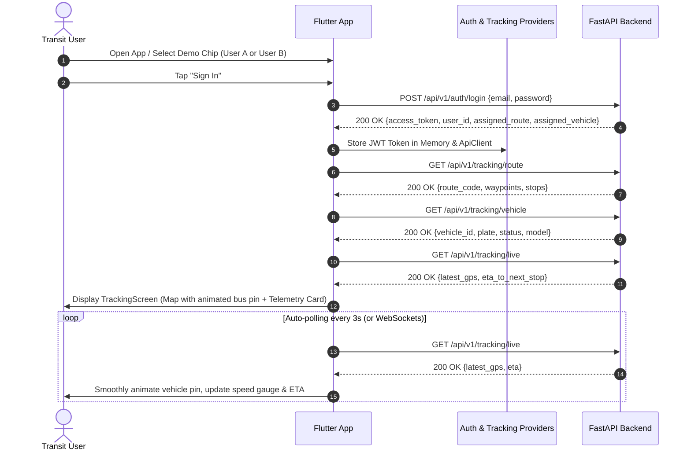

# TransitTrack Mobile (Flutter GPS Fleet Tracking Client)

A modern, responsive Flutter mobile application for real-time GPS vehicle tracking, bus route visualization, live telemetry monitoring, and historical trail analysis. Built with **Material 3**, **Provider** state management, and **flutter_map (OpenStreetMap)**.

---

## 📱 Application Flow & User Journey



---

## 🏛️ Flutter Architecture

The application adopts Clean Architecture with layered separation of concerns:

```
frontend/
├── lib/
│   ├── main.dart                       # App entry point, Material 3 Theme, MultiProvider setup
│   ├── core/
│   │   ├── constants/
│   │   │   └── api_constants.dart      # Platform-aware URL resolver (10.0.2.2 vs localhost)
│   │   └── network/
│   │       └── api_client.dart         # HTTP client with Bearer auth injection & exception mapping
│   ├── models/
│   │   ├── user_model.dart             # UserModel & profile parsing
│   │   ├── route_model.dart            # RouteModel & WaypointModel
│   │   ├── vehicle_model.dart          # VehicleModel metadata
│   │   └── gps_record_model.dart       # GPSRecordModel & ETAModel
│   ├── providers/
│   │   ├── auth_provider.dart          # Authentication state, login, logout, token persistence
│   │   └── tracking_provider.dart      # Real-time polling timer, route cache, history breadcrumbs
│   ├── screens/
│   │   ├── login_screen.dart           # Quick-switch demo accounts (Alice/Bob) + manual form
│   │   ├── tracking_screen.dart        # Full-screen interactive map with floating telemetry card
│   │   └── history_screen.dart         # Chronological list of historical GPS telemetry pings
│   └── widgets/
│       ├── map_view_widget.dart        # OpenStreetMap tile layer, route polyline & vehicle marker
│       ├── vehicle_card_widget.dart    # Telemetry card: speed gauge, heading compass, next stop ETA
│       └── common_widgets.dart         # Status badges, live pulse indicator, error alert banners
├── test/
│   └── widget_test.dart                # Automated UI & widget tests
└── pubspec.yaml                        # Dependencies: flutter_map, latlong2, provider, http
```

---

## ✨ Features

1. **Multi-User Authentication & Quick-Login**:
   - Quick demo chips to test **User A (Alice)** and **User B (Bob)** with 1 tap.
   - Dynamic server URL switcher (supports Android emulator `10.0.2.2`, Web/Desktop `localhost`, or custom LAN IP).
2. **Interactive Map View (`flutter_map`)**:
   - Free, open-source **OpenStreetMap** raster tiles (no Google Maps API key or billing required).
   - Draws route polylines in distinct brand colors (Indigo for Route A, Amber for Route B).
   - Shows numbered stops/waypoints.
   - Renders a pulsing, heading-oriented vehicle pin that smoothly tracks live coordinates.
   - "Center on Vehicle" FAB button.
3. **Live Telemetry & Transit Intelligence**:
   - Live speedometer gauge (`km/h`).
   - Compass heading with cardinal direction (`180° S`).
   - Real-time **ETA to Next Stop** calculation (`Next: Vidhana Soudha • ~2 mins (0.8 km)`).
   - Automatic **Over-speeding Caution Alert** if vehicle exceeds speed threshold.
4. **Historical Breadcrumb Log**:
   - Tabular and timeline view of historical GPS coordinates and speeds.
5. **Comprehensive Error Handling**:
   - Gracefully intercepts and displays `401 Unauthorized`, `403 Forbidden`, and connection drop alerts.

---

## 🚀 Setup & Execution

### Prerequisites
- [Flutter SDK](https://flutter.dev/docs/get-started/install) (version 3.0.0+)
- Google Chrome, Android Studio / Emulator, or Windows Desktop build tools.

### 1. Install Dependencies
```bash
flutter pub get
```

### 2. Run Automated Tests
```bash
flutter test
```

### 3. Run Application

- **On Google Chrome (Web)**:
  ```bash
  flutter run -d chrome
  ```
- **On Android Emulator**:
  ```bash
  flutter run -d android
  ```
- **On Windows Desktop**:
  ```bash
  flutter run -d windows
  ```

---

## 🔑 Demo Login Credentials

| User Account | Email | Password | Assigned Route | Assigned Vehicle |
|---|---|---|---|---|
| **User A (Alice)** | `user_a@example.com` | `Password123!` | Route A (Metro Downtown Express) | BUS-001 (Volvo 9400 EV) |
| **User B (Bob)** | `user_b@example.com` | `Password123!` | Route B (North Campus Shuttle) | BUS-002 (Tata SmartBus) |
